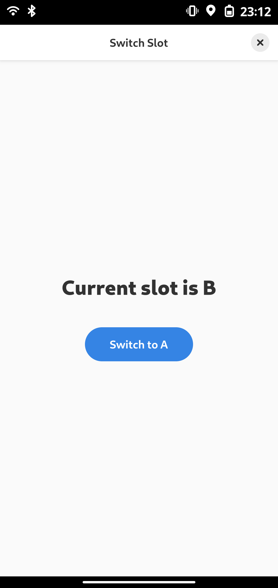

# Introduction
A Very small manager for Android A/B slots written in GTK4.

## Dependencies
- Libadwaita (In Alpine: libadwaita-dev)
- Gtk4 (In Alpine: gtk4.0-dev)
- Nim and Nimble >= 2.2.0
- Make
- Qbootctl

## TODO
- [ ] Dialog box that asks about reboot, while button is pressed

# License
This project is based on BSD-3 Clause License
